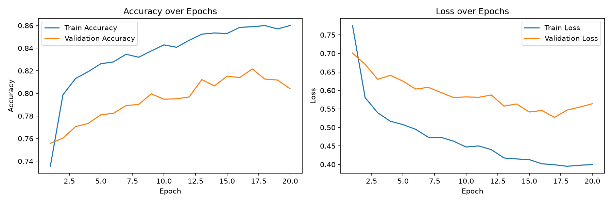
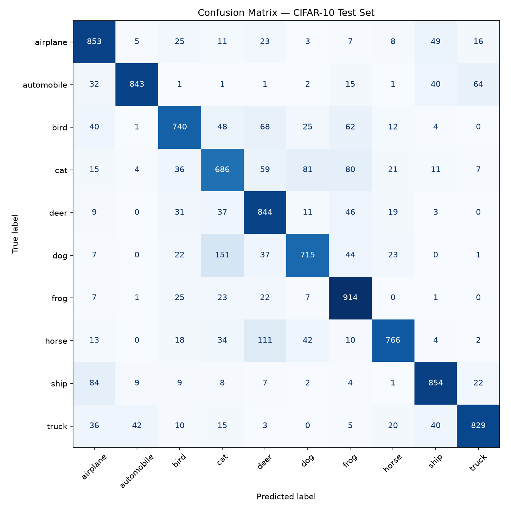
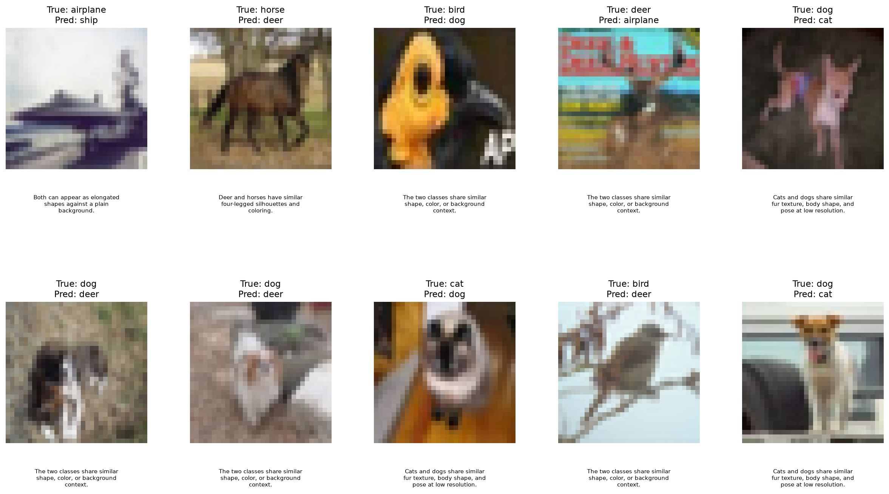

# CIFAR-10 Image Classifier with Transfer Learning

## Overview

This project implements an image classifier for the CIFAR-10 dataset using **transfer learning** with a pretrained **MobileNetV2** backbone. The model uses **ImageNet pretrained weights** (`include_top=False`) as a **frozen feature extractor**, with a custom classification head added for CIFAR-10 classification. Data augmentation techniques, including horizontal flips and random cropping, are applied during training to improve generalization and reduce overfitting.

The final model achieved a **test accuracy of 80.44%** on the CIFAR-10 dataset while keeping the pretrained backbone frozen throughout training.

## Project Structure

```text
cifar10-transfer-learning/
├── CIFAR10_Transfer_Learning.ipynb   # Main notebook containing data loading, training, and evaluation
├── README.md                         # Project documentation
├── requirements.txt                 # Required Python packages
├── cifar10_mobilenetv2_transfer.h5  # Trained MobileNetV2 transfer learning model
├── training_curves.png              # Training and validation accuracy/loss curves
├── confusion_matrix.png             # Confusion matrix on the test set
└── misclassified_examples.png       # Sample misclassified test images with explanations
```

## How to Run

1. Clone this repository or download the project files.
2. Install the required dependencies:

```bash
pip install -r requirements.txt
```

3. Open `CIFAR10_Transfer_Learning.ipynb` in Jupyter Notebook, VS Code, or Google Colab.
4. Run all cells from top to bottom.

### Dataset

This project uses the **CIFAR-10** dataset, consisting of 60,000 color images across 10 classes. The dataset can be downloaded from the official CIFAR-10 website or other public sources such as Kaggle.

No paid services, API keys, or private credentials are required.

## Setup

```bash
pip install -r requirements.txt
```

Then open `CIFAR10_Transfer_Learning.ipynb` in your preferred notebook environment and run all cells.

## Approach

1. **Dataset** - The CIFAR-10 dataset, consisting of 50,000 training images and 10,000 test images across 10 classes, was used for image classification. A validation set of 5,000 images was held out from the training data for model selection and evaluation.

2. **Data Augmentation** - Data augmentation techniques, including random horizontal flips and random cropping, were applied to improve generalization and reduce overfitting.

3. **Preprocessing** - The original 32×32 images were resized to 96×96 to match the input requirements of MobileNetV2 and preprocessed using MobileNetV2's `preprocess_input` function.

4. **Feature Extraction** - A pretrained `MobileNetV2` model (`weights='imagenet'`, `include_top=False`) was used as a frozen feature extractor by setting `base_model.trainable = False`.

5. **Classification Head** - A custom classification head consisting of `GlobalAveragePooling2D`, `Dropout(0.2)`, `Dense(128, ReLU)`, `Dropout(0.2)`, and `Dense(10, softmax)` layers was added on top of the pretrained backbone.

6. **Training** - The model was trained using the Adam optimizer (`learning_rate=1e-3`) and sparse categorical cross-entropy loss for up to 20 epochs with a batch size of 128. `EarlyStopping`, `ReduceLROnPlateau`, and `ModelCheckpoint` callbacks were used during training.

7. **Evaluation** - Model performance was evaluated using test accuracy, training and validation curves, a confusion matrix, and analysis of misclassified examples.

## Results

The final model achieved a **test accuracy of 80.44%** on the CIFAR-10 test set.

The following outputs were generated during evaluation:

- **Training Curves** (`training_curves.png`) - Visualization of training and validation accuracy and loss over epochs.
- **Confusion Matrix** (`confusion_matrix.png`) - Per-class prediction performance and common confusion pairs.
- **Misclassified Examples** (`misclassified_examples.png`) - Sample misclassified test images with their true labels, predicted labels, and brief explanations for the observed errors.

## Training Curves



## Confusion Matrix



## Misclassified Examples



### Performance Summary

| Metric | Value |
|---------|--------|
| Test Accuracy | **80.44%** |
| Test Loss | **0.5629** |
| Backbone | MobileNetV2 (ImageNet pretrained) |
| Backbone Frozen | Yes |
| Epochs | 20 |

## Reflection

This project demonstrates the effectiveness of transfer learning for image classification tasks. Using a frozen, pretrained MobileNetV2 backbone made it possible to achieve strong performance on the CIFAR-10 dataset without training a deep CNN from scratch. Data augmentation helped improve generalization, while most remaining errors occurred between visually similar classes such as cat/dog, deer/horse, and automobile/truck, which are well-known challenges in the CIFAR-10 dataset.

## Tech Stack

- TensorFlow / Keras
- Convolutional Neural Networks (CNNs)
- Transfer Learning (MobileNetV2, ImageNet pretrained weights)
- Data Augmentation (random flips and random crops)
- NumPy
- Matplotlib
- scikit-learn